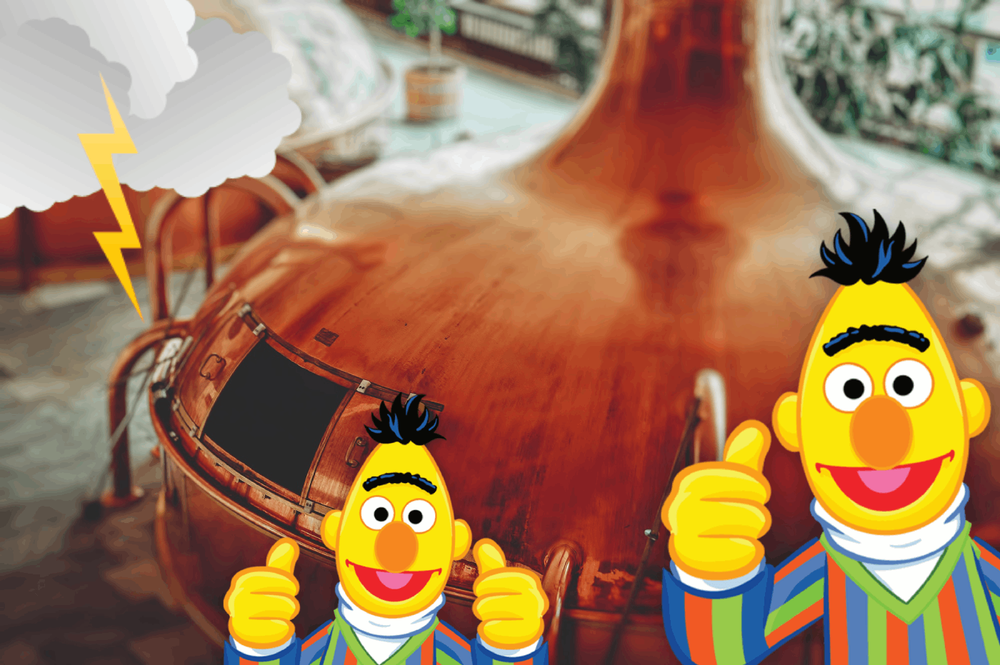

<!--

#################################################
### THIS FILE WAS AUTOGENERATED! DO NOT EDIT! ###
#################################################
# file to edit: index.ipynb
# command to build the docs after a change: nbdev_build_docs

-->

# Contextual Emotion Detection in Text (DoubleDistilBert Model)

> We use the excellent pytorch-lightning, Huggingface transformers, and fast.ai nbdev libraries for a clean and efficient implementation and demonstrate the performance of our model on the SemEval-2019 Task 3 dataset.

[SemEval-2019 Task 3 description](https://www.aclweb.org/anthology/S19-2005/): 

"Lack of facial expressions and voice modulations make detecting emotions in text a challenging problem. For instance, as humans, on reading "Why don't you ever text me!" we can either interpret it as a sad or angry emotion and the same ambiguity exists for machines. However, the context of dialogue can prove helpful in detection of the emotion. In this task, given a textual dialogue i.e. an utterance along with two previous turns of context, the goal was to infer the underlying emotion of the utterance by choosing from four emotion classes - Happy, Sad, Angry and Others. To facilitate the participation in this task, textual dialogues from user interaction with a conversational agent were taken and annotated for emotion classes after several data processing steps."

**Approach:** Pre-Trained DistilBert `transformers` model for sentence embeddings and contextual information via another Bert model on top

### Install

`pip install packaging`

`pip install git+https://github.com/juliusberner/emotion_transformer`

### How To Use

1. Training and testing the default configuration (e.g. on GPU with index 0)

    `python main.py --mode=test --gpus='0'`
    

2. Parallel hyperparameter search on 8 GPUs using half-precision (automatically done by `test_tube` and `pytorch_lightning`):

    `python main.py --mode=hparams_search --gpus='0 1 2 3 4 5 6 7' --use_16bit`

alternativ: Parallel hyperparameter search on 8 GPUs (2 GPUs with with specified indices for each setting):

`python main.py --mode=hparams_search --gpus='0,1 2,3 4,5 6,7' --distributed_backend='dp'`

(tested with nvidia-docker `FROM nvcr.io/nvidia/pytorch:19.02-py3` as specified in `requirements.txt`)

### Documentation

automatically created by `nbdev`: [Documentation](https://juliusberner.github.io/emotion_detect/)

### Notebooks

Jupyter notebooks explaining the dataloader, the model, and the lightning module:

`00_dataloader.ipynb`

`01_model.ipynb`

`02_lightning.ipynb`

### Featuring

* [PyTorch Lightning](https://github.com/williamFalcon/pytorch-lightning/): "Lightning is a very lightweight wrapper on PyTorch that decouples the science code from the engineering code. It's more of a style-guide than a framework. By refactoring your code, we can automate most of the non-research code."

* [Huggingface transformers](https://github.com/huggingface/transformers): "Transformers provides state-of-the-art general-purpose architectures (BERT, GPT-2, RoBERTa, XLM, DistilBert, XLNet, CTRL...) for Natural Language Understanding (NLU) and Natural Language Generation (NLG) with over 32+ pretrained models in 100+ languages and deep interoperability between TensorFlow 2.0 and PyTorch."

* [fast.ai nbdev](https://github.com/fastai/nbdev): "nbdev is a library that allows you to fully develop a library in Jupyter Notebooks, putting all your code, tests and documentation in one place."

* [William Falcon's test tube](https://github.com/williamFalcon/test-tube) "Test tube is a python library to track and parallelize hyperparameter search for Deep Learning and ML experiments. It's framework agnostic and built on top of the python argparse API for ease of use."

